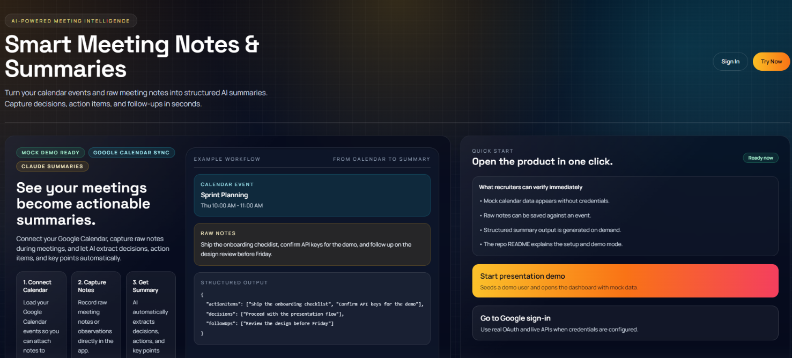
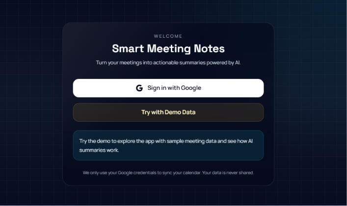
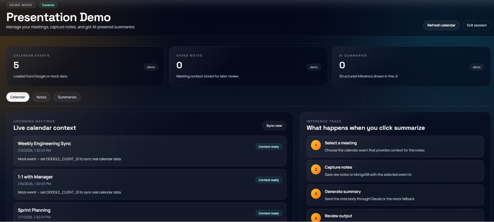

# AI-Integrated Scheduling & Notes Tool

<p align="center">
  
  
  
  
  
</p>

<p align="center">
  Turn calendar context and raw meeting notes into structured, actionable AI summaries.<br/>
  Runs fully live with Google OAuth + Claude, or in a zero-config demo mode — the entire flow is always visible.
</p>

---

## Preview

### Landing — the product in one screen
The homepage doubles as a walkthrough: connect a calendar, capture notes, get a structured summary — with a live example of the exact JSON Claude returns.



### Sign in — real auth or instant demo
Two paths in one screen: real Google OAuth for the full experience, or a single click into demo data with no setup required.



### Dashboard — calendar, notes, and the inference trace
The dashboard tracks calendar events, saved notes, and generated summaries side by side, with an **Inference Trace** panel that shows exactly what happens, step by step, when you click "Summarize."



---

## What this project actually does

1. **Connect Calendar** — Google Calendar events are pulled in via OAuth2 and used as context for note-taking.
2. **Capture Notes** — Raw meeting notes are recorded and attached to a specific calendar event.
3. **Get Summary** — The note body is sent to Claude (Anthropic), which returns structured `actionItems`, `decisions`, `followUps`, and key points as JSON.

No API keys are required to explore it — a built-in mock/demo mode simulates calendar data and summary generation so the entire pipeline is visible without any configuration.

## Tech stack

| Layer | Technology |
|---|---|
| Frontend | Next.js 14 (App Router), React, Tailwind CSS, TanStack Query |
| Backend | NestJS, Passport (Google OAuth2), JWT sessions |
| Database | MongoDB (Atlas), Mongoose |
| AI | Anthropic Claude API (`claude-3-5-sonnet`) |
| Shared | TypeScript types shared across `apps/web` and `apps/api` via an npm workspace package |
| Infra | Docker Compose for local MongoDB/Redis |

## Architecture

```
.
├── apps/
│   ├── api/            # NestJS backend
│   │   └── src/modules/
│   │       ├── auth/        # Google OAuth2 + JWT + demo fallback
│   │       ├── calendar/    # Google Calendar sync
│   │       ├── notes/       # Meeting notes CRUD
│   │       └── summaries/   # Claude API integration
│   └── web/             # Next.js frontend
│       └── app/
│           ├── page.tsx        # Landing
│           ├── auth/page.tsx   # Sign-in
│           └── dashboard/      # Calendar / Notes / Summaries tabs
├── packages/
│   └── shared/           # Shared TypeScript types
└── docker-compose.yml     # Local MongoDB + Redis
```

## Getting started

### Option 1 — Try it instantly (no setup)
Click **"Try with Demo Data"** from the sign-in screen. This seeds mock calendar events and lets you exercise the full notes → summary flow without any credentials.

### Option 2 — Run it locally with live data

```bash
git clone https://github.com/munazat/AI-Integrated-Scheduling-Notes-Tool.git
cd AI-Integrated-Scheduling-Notes-Tool
npm install
```

Copy `.env.example` into `apps/api/.env` and `apps/web/.env.local` and fill in:
- A MongoDB connection string (Atlas free tier works well — see `DEPLOYMENT.md`)
- Google OAuth `CLIENT_ID` / `CLIENT_SECRET` (for live calendar sync)
- An `ANTHROPIC_API_KEY` (for live summaries — omit it to fall back to mock summaries automatically)

```bash
npm run dev
```

This starts both the NestJS API and the Next.js frontend. Open `http://localhost:3000`.

## Roadmap / known limitations

- No automated test suite yet — planned: unit tests around the Claude response parsing/fallback logic in `summaries.service.ts`.
- No CI pipeline yet — planned: a GitHub Actions workflow for lint + build on PRs.
- Redis is provisioned in `docker-compose.yml` for future caching (e.g. calendar sync results) but not yet wired into the application.
